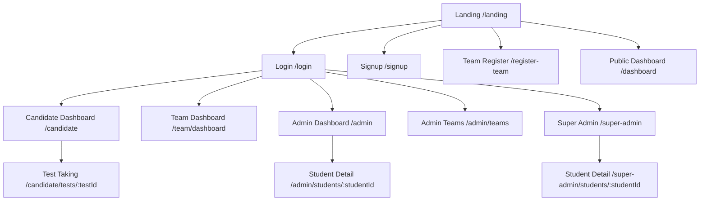

# Navigation Map

## Root Redirect Logic
- authenticated super-admin -> /super-admin
- authenticated admin -> /admin or /admin/teams (platform-admin authType)
- authenticated candidate -> /candidate
- authenticated team -> /team/dashboard
- unauthenticated -> /landing
