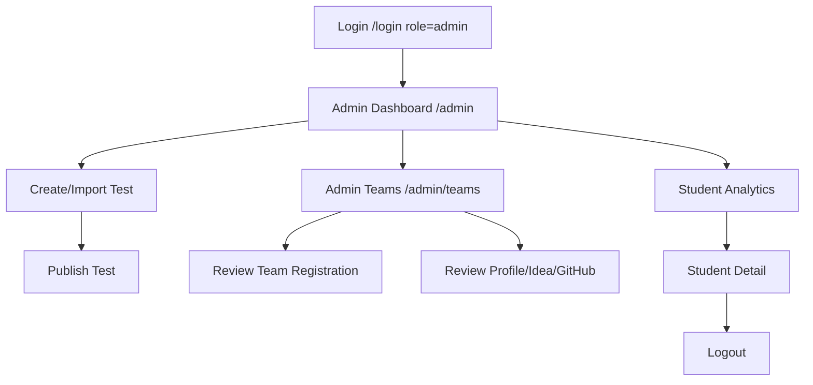
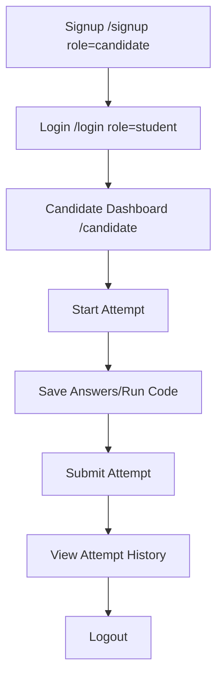
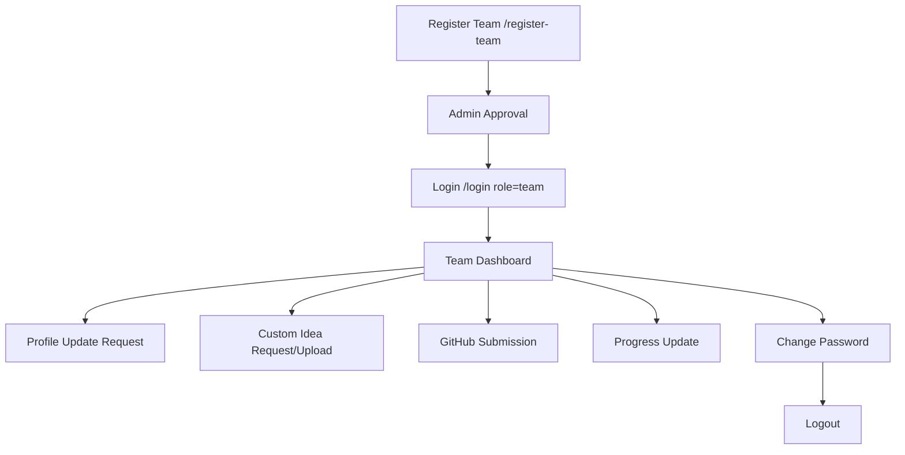
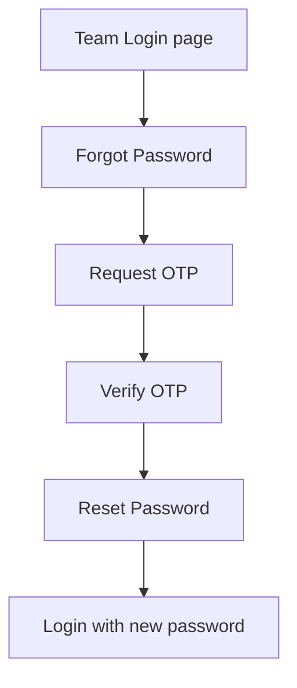

# End-to-End Flow Diagrams

## Admin Flow

```mermaid
flowchart TD
  A[Login /login role=admin] --> B[Admin Dashboard /admin]
  B --> C[Create/Import Test]
  C --> D[Publish Test]
  B --> E[Admin Teams /admin/teams]
  E --> F[Review Team Registration]
  E --> G[Review Profile/Idea/GitHub]
  B --> H[Student Analytics]
  H --> I[Student Detail]
  I --> J[Logout]
```

## Student Flow

```mermaid
flowchart TD
  A[Signup /signup role=candidate] --> B[Login /login role=student]
  B --> C[Candidate Dashboard /candidate]
  C --> D[Start Attempt]
  D --> E[Save Answers/Run Code]
  E --> F[Submit Attempt]
  F --> G[View Attempt History]
  G --> H[Logout]
```

## Team Flow

```mermaid
flowchart TD
  A[Register Team /register-team] --> B[Admin Approval]
  B --> C[Login /login role=team]
  C --> D[Team Dashboard]
  D --> E[Profile Update Request]
  D --> F[Custom Idea Request/Upload]
  D --> G[GitHub Submission]
  D --> H[Progress Update]
  D --> I[Change Password]
  I --> J[Logout]
```

## Team Password Reset Flow

```mermaid
flowchart TD
  A[Team Login page] --> B[Forgot Password]
  B --> C[Request OTP]
  C --> D[Verify OTP]
  D --> E[Reset Password]
  E --> F[Login with new password]
```
